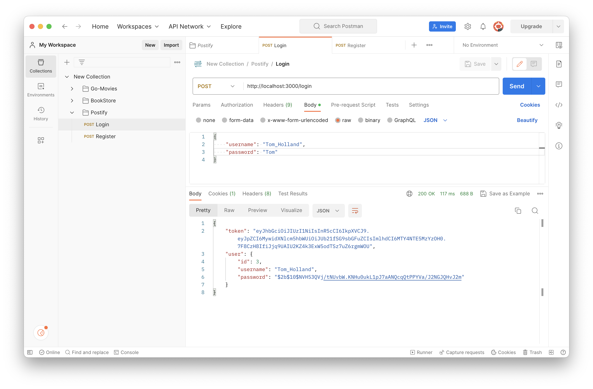
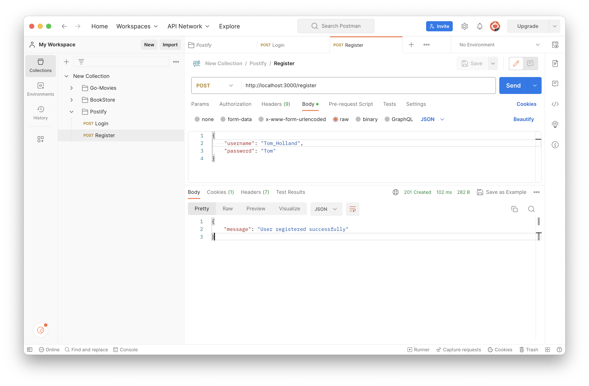
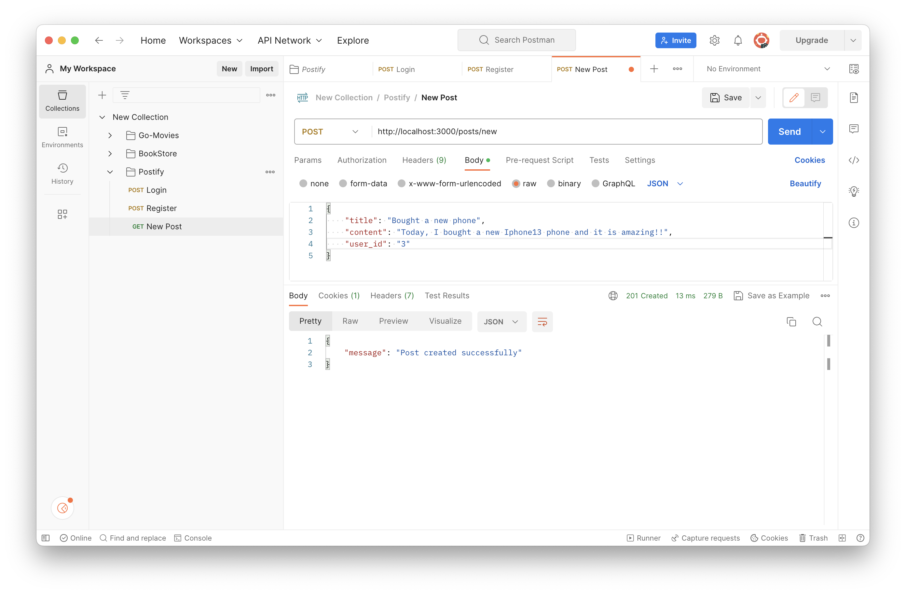
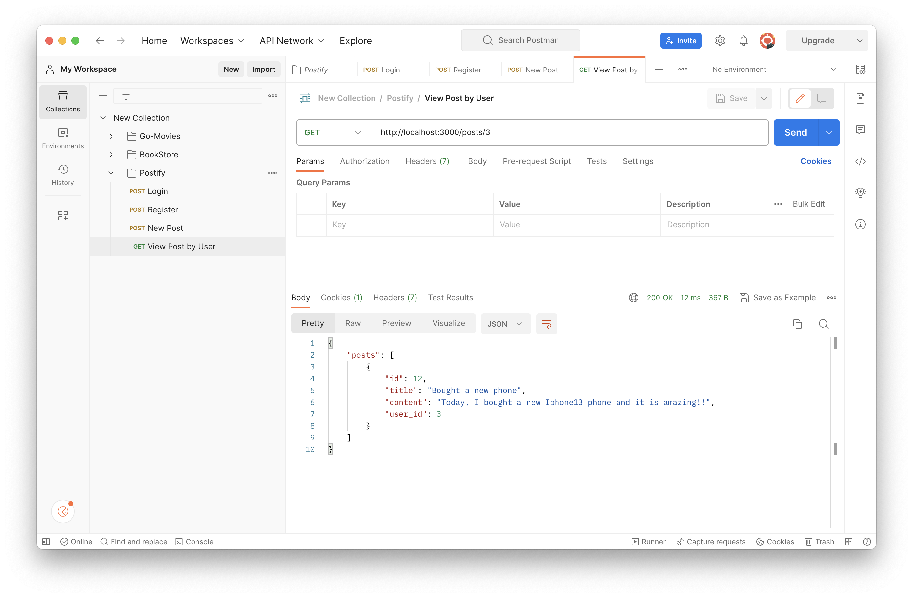
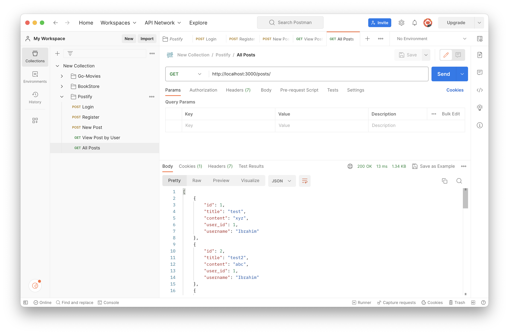

# Postify

It is a simple web API that allows users to register and create posts.

The API have the following functionality:

-   POST /login - process the login credentials and return a token for authorization
-   POST /register - validate the user's registration information and insert a new user into the "users" table. If the registration is successful, return a success message. If the registration is unsuccessful, return an error message.
-   GET /posts - query the "posts" table and return a list of all posts. The list should include the username of the user who created each post.
-   GET /posts/:userId - query the "posts" table and return a list of all posts by the specified user.
-   POST /posts/new - validate the user's post information and insert a new post into the "posts" table. If the post is successful, return a success message. If the post is unsuccessful, return an error message.

## Technologies

It is build using

-   Express js
-   MySql Database

## Solution

-   <h3>Login</h3>

-   <h3>Register</h3>

-   <h3>New Post</h3>

-   <h3>Post by UserId</h3>

-   <h3>All Post</h3>

